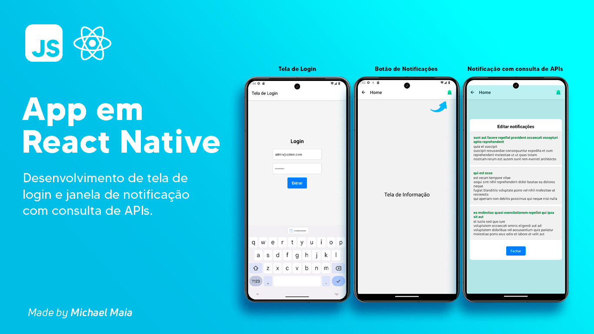

# Projeto de Aplicativo React Native

Este projeto consiste na criação de um aplicativo simples em **React Native** com duas páginas principais: uma página de login fake e uma página de exibição de notificações. A página de notificações consulta uma API externa (https://jsonplaceholder.typicode.com/posts?userId=1) para exibir os dados.

## Funcionalidades

O aplicativo possui as seguintes funcionalidades:

1. **Página de Login**: 
   - Página de login simples com autenticação fake (não é necessário chamar a API para autenticação).
   - Campos: Usuário e Senha (valores estáticos para fins de demonstração).

2. **Página de Notificações**:
   - Página que consulta a API pública **JSONPlaceholder** para exibir notificações de um usuário específico.
   - A API utilizada é `GET https://jsonplaceholder.typicode.com/posts?userId=1`.
   - Exibe os campos `title` e `body` de cada notificação.

## Estrutura do Projeto

O aplicativo segue a estrutura padrão de um projeto React Native com os seguintes componentes principais:

- **LoginPage**: Página de login com campos para nome de usuário e senha.
- **NotificationsPage**: Página que exibe a lista de notificações consultadas da API externa.

## Tecnologias Utilizadas

- **React Native**: Framework para desenvolvimento de aplicativos móveis nativos.
- **Axios**: Biblioteca para realizar requisições HTTP.
- **React Navigation**: Biblioteca para navegação entre páginas no aplicativo.
- **JSONPlaceholder**: API pública para simular dados de notificações.

## Pré-requisitos

Antes de rodar o projeto, é necessário ter os seguintes itens instalados:

- **Node.js**: Para gerenciar pacotes e rodar o aplicativo.
- **React Native CLI ou Expo**: Ferramentas para desenvolvimento com React Native.
- **Emulador Android/iOS ou dispositivo físico** para rodar o aplicativo.

